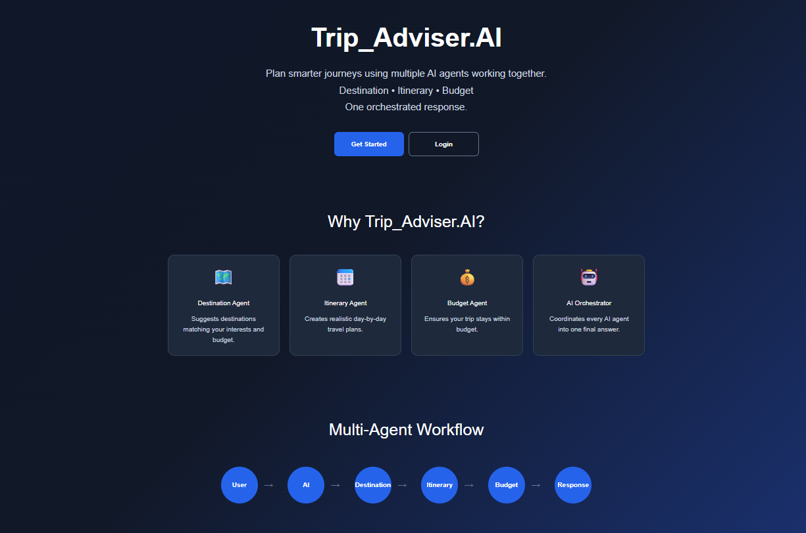
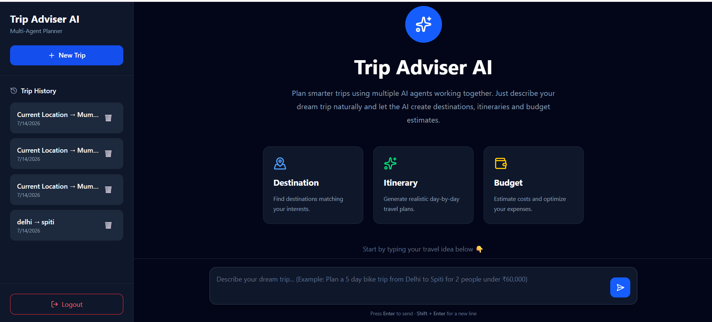
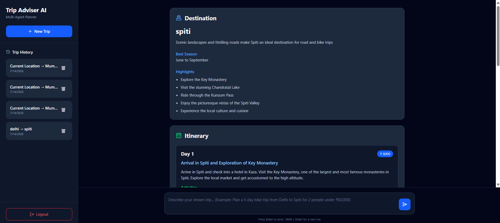
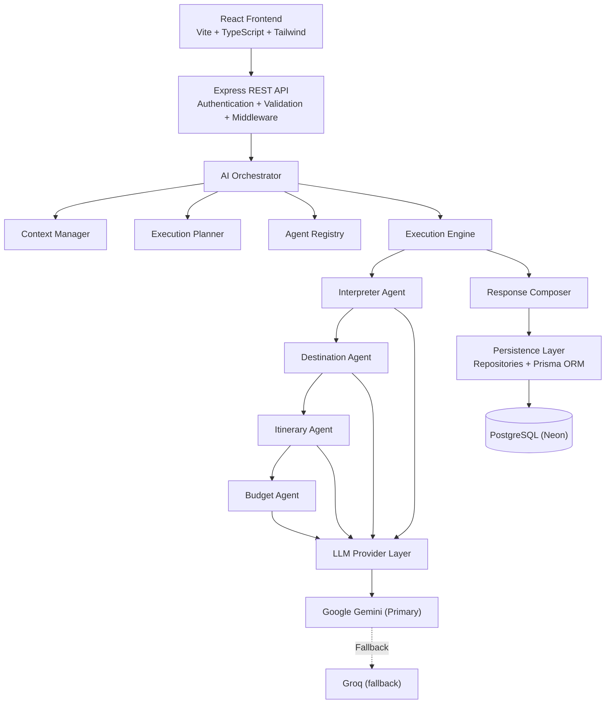
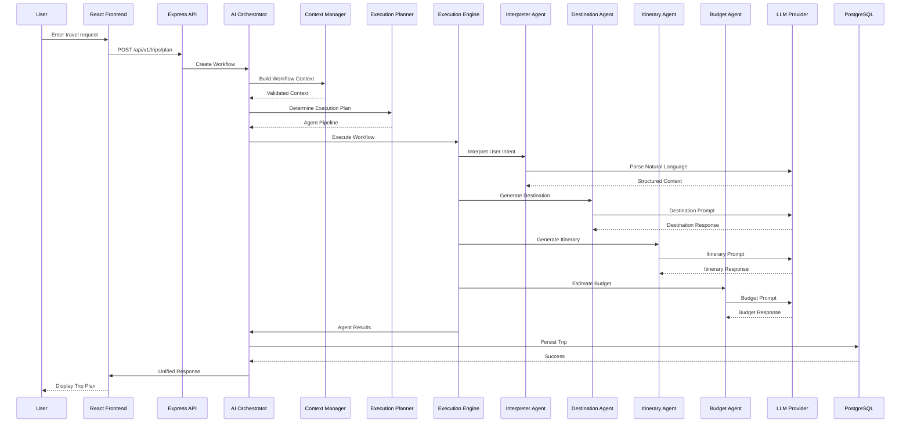

# 🌍 Trip Adviser AI

> **AI-powered multi-agent travel planner** built with **React 18,
> TypeScript, Node.js, Prisma, PostgreSQL, Groq & Gemini**.

## 🚀 Live Demo

-   Frontend: https://trip-adviser-ai-frontend.vercel.app
-   Backend Health: https://trip-adviser-ai.onrender.com/api/v1/health

## 📸 Screenshots

| Landing Page | AI Planner |
|--------------|------------|
|  |  |

<br>

| Generated Trip |
|----------------|
|  |

## ✨ Features

-   Multi-Agent AI Orchestration
-   Destination, Itinerary & Budget Agents
-   JWT Authentication
-   PostgreSQL + Prisma
-   Trip History & Delete Trip
-   Responsive UI
-   Mobile Drawer Navigation
-   Groq + Gemini Fallback
-   Turborepo Monorepo

## 🏗 System Architecture



## 🔄 Workflow



## 📁 Project Structure

``` text
Trip_Adviser.AI
├── apps
│   ├── backend
│   └── frontend
├── packages
│   └── shared
├── docs
├── turbo.json
└── pnpm-workspace.yaml
```

## 🛠 Tech Stack

### Frontend

-   React 18
-   TypeScript
-   Vite
-   Tailwind CSS

### Backend

-   Node.js
-   Express
-   Prisma
-   PostgreSQL

### AI

-   Groq
-   Google Gemini

### Deployment

-   Vercel
-   Render
-   Neon PostgreSQL

## 📦 API

-   POST /api/v1/auth/register
-   POST /api/v1/auth/login
-   POST /api/v1/trips/plan
-   GET /api/v1/trips
-   GET /api/v1/trips/:id
-   DELETE /api/v1/trips/:id

## ⚙️ Setup

``` bash
git clone https://github.com/shujaa786/Trip_Adviser.AI.git
cd Trip_Adviser.AI
pnpm install
pnpm dev
```

## 🌍 Environment

``` env
DATABASE_URL=
JWT_SECRET=
GROQ_API_KEY=
GEMINI_API_KEY=
VITE_API_BASE_URL=
```

## 📈 Future Improvements

-   Streaming responses
-   Weather integration
-   Maps integration
-   Conversation memory
-   Role-based access
-   Observability

## 📄 License

MIT
