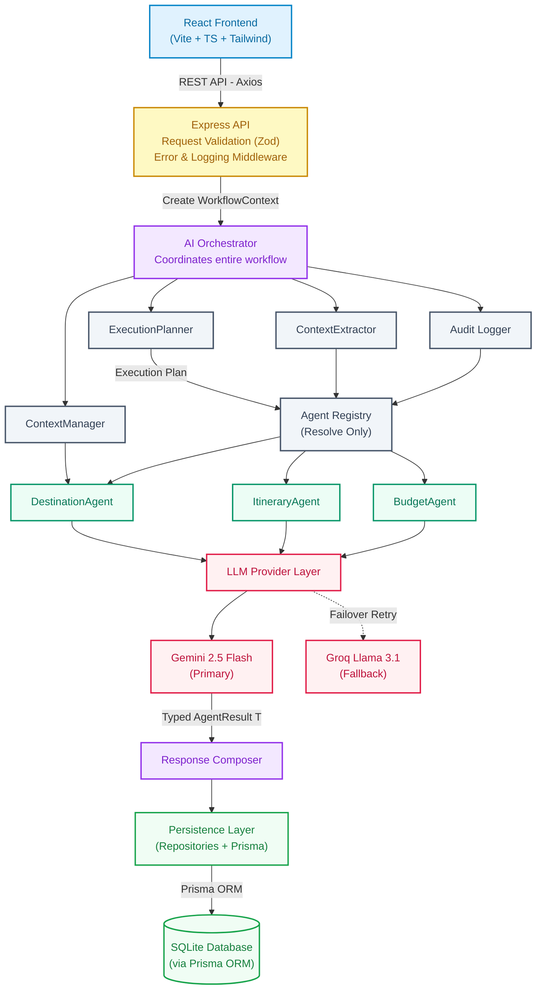

### 🏗️ Complete System Architecture

```mermaid
graph TD
    %% Styling Definitions
    classDef frontend fill:#e0f2fe,stroke:#0284c7,stroke-width:2px,color:#0369a1;
    classDef api fill:#fef9c3,stroke:#ca8a04,stroke-width:2px,color:#a16207;
    classDef core fill:#f3e8ff,stroke:#9333ea,stroke-width:2px,color:#7e22ce;
    classDef module fill:#f1f5f9,stroke:#475569,stroke-width:2px,color:#334155;
    classDef agent fill:#ecfdf5,stroke:#059669,stroke-width:2px,color:#047857;
    classDef llm fill:#fff1f2,stroke:#e11d48,stroke-width:2px,color:#be123c;
    classDef db fill:#f0fdf4,stroke:#16a34a,stroke-width:2px,color:#15803d;

    %% Main Layout Nodes
    FE["React Frontend<br>(Vite + TS + Tailwind)"]:::frontend
    EX["Express API<br>Request Validation (Zod)<br>Error & Logging Middleware"]:::api
    ORCH["AI Orchestrator<br>Coordinates entire workflow"]:::core
    
    %% Core Orchestrator Children
    CM["ContextManager"]:::module
    CE["ContextExtractor"]:::module
    EP["ExecutionPlanner"]:::module
    AL["Audit Logger"]:::module
    
    AR["Agent Registry<br>(Resolve Only)"]:::module
    
    %% Functional Agents
    DA["DestinationAgent"]:::agent
    IA["ItineraryAgent"]:::agent
    BA["BudgetAgent"]:::agent
    
    %% Base Tech Infrastructure
    LLM["LLM Provider Layer"]:::llm
    G_PRI["Gemini 2.5 Flash<br>(Primary)"]:::llm
    G_FB["Groq Llama 3.1<br>(Fallback)"]:::llm
    
    RC["Response Composer"]:::core
    PL["Persistence Layer<br>(Repositories + Prisma)"]:::db
    DB[("SQLite Database<br>(via Prisma ORM)")]:::db

    %% Precise Connections Based On Box Routing
    FE -->|REST API - Axios| EX
    EX -->|Create WorkflowContext| ORCH
    
    ORCH --> CM
    ORCH --> CE
    ORCH --> EP
    ORCH --> AL
    
    EP -->|Execution Plan| AR
    CE --> AR
    AL --> AR
    
    CM --> DA
    AR --> DA
    AR --> IA
    AR --> BA
    
    DA & IA & BA --> LLM
    
    LLM --> G_PRI
    LLM -.->|Failover Retry| G_FB
    
    G_PRI -->|Typed AgentResult T| RC
    RC --> PL
    PL -->|Prisma ORM| DB
```

---
