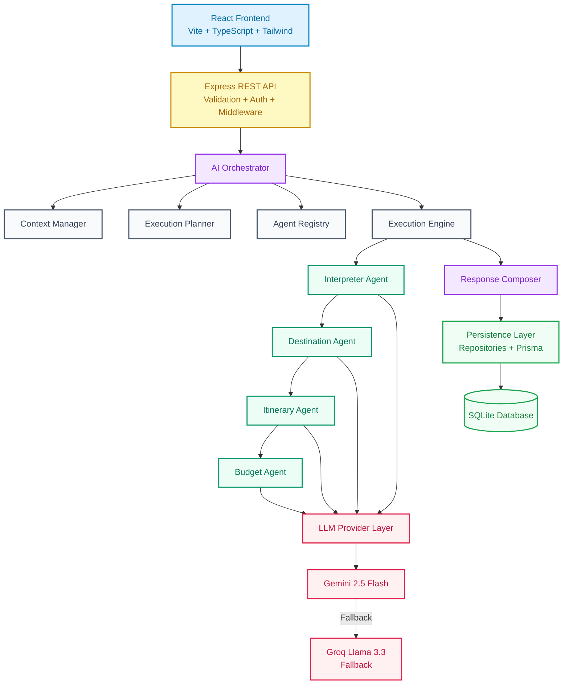

### 🏗️ Complete System Architecture

```mermaid
graph TD

    %% Styling
    classDef frontend fill:#e0f2fe,stroke:#0284c7,stroke-width:2px,color:#0369a1;
    classDef api fill:#fef9c3,stroke:#ca8a04,stroke-width:2px,color:#a16207;
    classDef core fill:#f3e8ff,stroke:#9333ea,stroke-width:2px,color:#7e22ce;
    classDef module fill:#f8fafc,stroke:#475569,stroke-width:2px,color:#334155;
    classDef agent fill:#ecfdf5,stroke:#059669,stroke-width:2px,color:#047857;
    classDef llm fill:#fff1f2,stroke:#e11d48,stroke-width:2px,color:#be123c;
    classDef db fill:#f0fdf4,stroke:#16a34a,stroke-width:2px,color:#15803d;

    FE["React Frontend<br/>Vite + TypeScript + Tailwind"]:::frontend

    API["Express REST API<br/>Validation + Auth + Middleware"]:::api

    ORCH["AI Orchestrator"]:::core

    CTX["Context Manager"]:::module
    PLAN["Execution Planner"]:::module
    REG["Agent Registry"]:::module
    EXEC["Execution Engine"]:::module
    RESP["Response Composer"]:::core

    INT["Interpreter Agent"]:::agent
    DEST["Destination Agent"]:::agent
    ITI["Itinerary Agent"]:::agent
    BUD["Budget Agent"]:::agent

    LLM["LLM Provider Layer"]:::llm
    GEM["Gemini 2.5 Flash"]:::llm
    GROQ["Groq Llama 3.3<br/>Fallback"]:::llm

    PERSIST["Persistence Layer<br/>Repositories + Prisma"]:::db
    DB[("SQLite Database")]:::db

    FE --> API

    API --> ORCH

    ORCH --> CTX
    ORCH --> PLAN
    ORCH --> REG
    ORCH --> EXEC

    EXEC --> INT
    INT --> DEST
    DEST --> ITI
    ITI --> BUD

    INT --> LLM
    DEST --> LLM
    ITI --> LLM
    BUD --> LLM

    LLM --> GEM
    GEM -. Fallback .-> GROQ

    EXEC --> RESP

    RESP --> PERSIST

    PERSIST --> DB
```